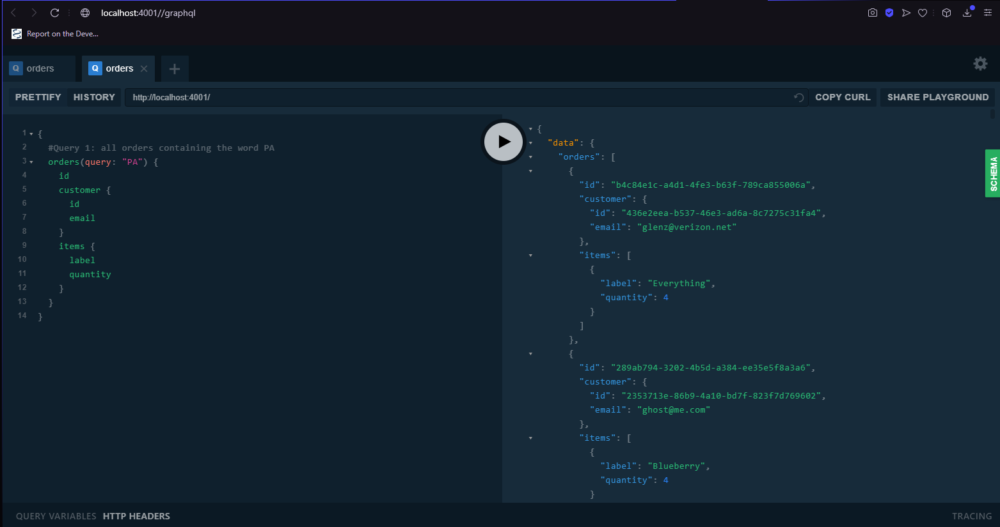

# Lab Report: Monitoring
___
**Course:** CIS 411, Spring 2021  
**Instructor(s):** [Trevor Bunch](https://github.com/trevordbunch)  
**Name:** Bryan Chang  
**GitHub Handle:** Triggum   
**Repository:** https://github.com/trevordbunch/cis411_lab0_req.git
**Collaborators:** 
@JoeV22
___

# Step 1: Fork this repository
- The URL of my forked repository
  - https://github.com/Triggum/cis411_lab5_Monitoring.git

# Step 2: Clone your forked repository from the command line
- My GraphQL response from adding myself as an account on the test project
```
{
  "data": {
    "mutateAccount": {
      "id": "d2ec469d-c5cd-43b2-9b68-60561ae92cb0",
      "name": "Bryan Chang",
      "email": "bwaybig@gmail.com"
    }
  }
}
```

# Step 3: Signup for and configure New Relic
- The chosen name of your New Relic ```app_name``` configuration
```
app_name: ['<CIS411Lab5>']
```

# Step 4: Exercising the application / generating performance data

_Note: No lab notes required._

# Step 5: Explore your performance data
* What are your observations regarding the performance of this application? 
  > The application gives me a lot of useful information about the query like, the web transaction time, throughput, error rate, CPU utilization and more.  
* Is performance even or uneven? 
  > Performance is uneven
* Between queries and mutations, what requests are less performant? 
  > Queries are less performant depending on what the query is. If a query requires everything from a table, it might take longer.
* Among the less performant requests, which ones are the most problematic?
  > The ones that result in a large amount of information being returned for a query.

# Step 6: Diagnosing an issue based on telemetry data
* Within the transactions you're examining, what segment(s) took the most time?
  > The remainder took most of the time.
* Using New Relic, identify and record the least performant request(s).
  > Query 6 took the longest time with 37,136ms, and the second longest time was query 1 with 4,655ms for comparison.
* Using the Transaction Trace capability in New Relic, identify which segment(s) in that request permeation is/are the most problematic and record your findings.
  > The most problematic segment was the remainder segment which took 92% of the time.
* Recommend a solution for improving the performance of those most problematic request(s) / permeation(s).
  > You be more specific in your query. For query 1, If you replace "query" with location, the time it takes to retrieve the information drastically drops.

# Step 7: Submitting a Pull Request
_Note: No lab notes required._

# Step 8: [EXTRA CREDIT] Address the performance issue(s)
For the purposes of gaining 25% extra credit on the assignment, perform any of the following:
1. Adjust the diagnosed slow call(s) to improve performance.  
   >The diagnosed slow call
   
   Adjusted
   

2. Verify the improved performance in New Relic, **including data and/or screenshots in your lab report**.
   >Performance Data
   
   
3. Check in those changes and **note your solution(s)** in your lab report.
   >The first query took 6,414ms to complete. The second one took a significantly lower time.